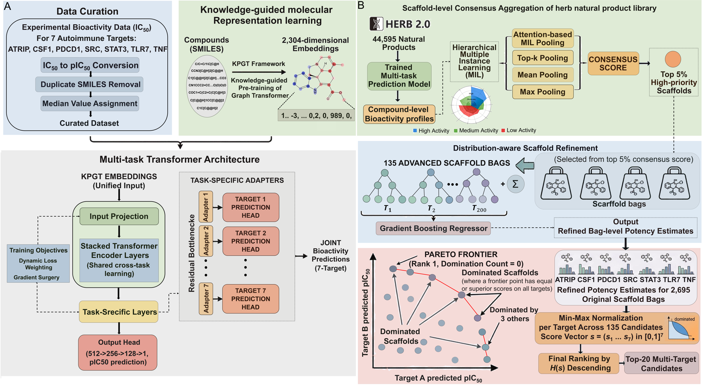

# KnowGraph-MTD

A codebase for knowledge-guided graph representation learning, multitask
bioactivity prediction, and hierarchical multiple-instance screening of natural
product libraries against a panel of autoimmune-relevant protein targets.

## Overview

This repository implements an end-to-end pipeline for multi-target natural
product discovery: curated bioactivity data are converted to pIC50 labels,
embedded with a knowledge-guided graph transformer (KPGT), fed into a
multitask transformer with task-specific adapters, and the resulting
compound-level predictions are aggregated at the scaffold level through
hierarchical multiple instance learning (MIL), refined by gradient boosting,
and ranked by hypervolume-based Pareto frontier analysis.

The pipeline targets seven proteins:

| Target | Full name | Role |
|---|---|---|
| TNF | Tumor necrosis factor | Pro-inflammatory cytokine |
| STAT3 | Signal transducer and activator of transcription 3 | Cytokine signaling / immune regulation |
| TLR7 | Toll-like receptor 7 | Innate immune sensing |
| CSF1 | Colony-stimulating factor 1 | Macrophage regulation |
| PDCD1 | Programmed cell death protein 1 | Adaptive immune checkpoint |
| SRC | Proto-oncogene tyrosine-protein kinase Src | Immune cell signaling |
| ATRIP | ATR-interacting protein | DNA-damage / immune signaling |

## Pipeline



The pipeline has two main parts:

- **Part A: Representation learning and multitask prediction.** Experimental
  IC50 measurements are curated (pIC50 conversion, duplicate removal, median
  assignment), molecular structures are embedded into 2,304-dimensional KPGT
  representations, and a shared transformer encoder with task-specific adapters
  jointly predicts bioactivity across all seven targets. Training uses dynamic
  loss weighting and gradient surgery to mitigate negative transfer.
- **Part B: Scaffold-level screening and ranking.** A natural product library
  is grouped into Bemis–Murcko scaffold bags; instance-level predictions are
  aggregated by attention-based MIL, top-k, mean, and max pooling into
  consensus scores; top scaffold bags are refined with a gradient boosting
  regressor; and candidates are ranked by a hypervolume-based Pareto frontier.

## Repository structure

```
KnowGraph-MTD/
├── README.md                     # This file
├── .gitignore
├── assets/
│   └── pipeline.png              # Pipeline figure
├── data/
│   ├── README.md                 # Data description and availability
│   ├── bioactivity/              # Curated bioactivity data for the 7 targets (*.tsv)
│   ├── targets/                  # Target protein structures and sequences (PDB/FASTA)
│   ├── libraries/                # Natural product libraries (HERB, CMAUP, TCMNCs, NCs sample)
│   └── representations/
│       └── TCMNCs/               # Small example of precomputed KPGT features
├── mtl/                          # Multitask bioactivity model
│   ├── README.md                 # Architecture, training, and ablation documentation
│   ├── config.py                 # Hyperparameters and ablation flags
│   ├── model.py                  # Input projection + transformer blocks + adapters + heads
│   ├── data.py                   # pIC50 conversion, deduplication, splits, datasets
│   ├── metrics.py                # RMSE / MAE / R² / Pearson r / ROC-AUC / PR-AUC
│   ├── trainer.py                # Dynamic loss weighting, gradient surgery, training loop
│   ├── prepare.py                # CLI: prepare bioactivity tables for feature extraction
│   └── train.py                  # CLI: train / evaluate / ablation sweep
└── kpgt/                         # KPGT code
    ├── src/                      # LiGhT graph transformer (model, data, trainers)
    ├── scripts/                  # Pretraining, finetuning, feature extraction,
    │   │                         # MIL screening, IC50-aware scoring
    │   └── mil_results/          # External-validation screening results
    ├── environment.yml / env.yml / env.yaml
    ├── README.md / README_CPU.md / Representation.md
    └── LICENSE                   # Apache License 2.0 (upstream KPGT)
```

## Data

Detailed descriptions, schemas, and row counts are provided in
[`data/README.md`](data/README.md).

- `data/bioactivity/` — curated bioactivity datasets for the seven targets
  (SMILES, target name, IC50 in nM, curation source, and target PDB IDs).
- `data/targets/` — PDB structures and FASTA sequences of the seven target
  proteins.
- `data/libraries/` — the HERB natural product library used for screening,
  plus external validation libraries (CMAUP, TCMNCs) and a toy sample of the
  NCs library.
- `data/representations/TCMNCs/` — a small-scale example of the precomputed
  features consumed by the screening scripts (KPGT embeddings, RDKit molecular
  descriptors, and RDKit fingerprints).

**Toy-data policy.** This repository ships only a light-weight subset of the
precomputed resources (see `data/README.md`). Large processed files —
full-scale KPGT feature matrices (`*.npz`), memmap files (`*.dat`), pickled
processed datasets (`*.pkl`), and pretrained/fine-tuned model checkpoints
(`*.pth`) — are excluded because of their size (up to several GB). These can
be requested from the corresponding author.

## Requirements

- Python 3.12
- PyTorch 2.7
- scikit-learn 1.7.0
- RDKit 2025.03.4
- SHAP 0.47.2
- umap-learn 0.5.7

For the KPGT environment, create a conda environment from
`kpgt/environment.yml` as described in [`kpgt/README.md`](kpgt/README.md):

```bash
cd kpgt
conda env create -f environment.yml
conda activate KPGT
```

## Usage

### 1. Generate KPGT molecular embeddings

Use a pretrained KPGT model (download instructions in `kpgt/README.md`) to
embed SMILES:

```bash
cd kpgt/scripts
python extract_features.py --config base --model_path <pretrained_model_path> \
    --data_path <smiles_csv_dir> --device auto
```

### 2. Train and evaluate the multitask bioactivity model

The `mtl/` module implements a shared transformer encoder with task-specific
adapter layers and output heads, trained with dynamic loss weighting and
gradient surgery. It consumes the KPGT embeddings produced in step 1.

```bash
# Prepare bioactivity tables (pIC50 conversion + deduplication)
python -m mtl.prepare --data-dir data/bioactivity --out-dir data/features/prepared

# Full model, scaffold split
python -m mtl.train --data-dir data/bioactivity --features-dir data/features \
    --split scaffold --ablation full --seed 22

# Five-seed run
python -m mtl.train --ablation full --seeds 22,42,62,82,102

# Ablation sweep (dynamic weighting / gradient surgery / adapter removal)
python -m mtl.train --ablation no_dwa --seeds 22,42,62,82,102
python -m mtl.train --ablation no_gs --seeds 22,42,62,82,102
python -m mtl.train --ablation no_adapter --seeds 22,42,62,82,102
```

See [`mtl/README.md`](mtl/README.md) for the full documentation (architecture,
all ablation modes, outputs, and requirements).

Fine-tuning and evaluation of the KPGT/LiGhT backbone itself:

```bash
python finetune.py --config base --model_path <pretrained_model_path> --data_path <dataset_dir>
python evaluation.py --config base --model_path <checkpoint> --data_path <dataset_dir>
```

### 3. Scaffold-level MIL screening

`ProjectionHead_MIL.py` implements the two-phase hierarchical MIL screening
(scaffold bag construction, multi-pooling consensus scoring, and gradient
boosting refinement) over precomputed KPGT features:

```bash
python ProjectionHead_MIL.py --help
```

### 4. IC50-aware external validation scoring

`IC50_aware_MIL_scoring.py` performs IC50-aware contrastive scoring of
external natural product libraries (NCs, CMAUP, TCMNCs) against the
seven-target panel:

```bash
python IC50_aware_MIL_scoring.py --help
```

Precomputed results are available in `kpgt/scripts/mil_results/`.

## Configuration

- Random seeds: `{22, 42, 62, 82, 102}`.
- Data partitioning: random split (80/10/10) and Bemis–Murcko scaffold-based
  split.
- Ranking stability: 1,000 Dirichlet-sampled weight perturbations.

## License and data availability

- The KPGT code under `kpgt/` is licensed under the **Apache License 2.0**
  (see `kpgt/LICENSE`).
- The curated bioactivity data, natural product libraries, and screening
  results in `data/` are released for research use; please contact the authors
  for full-scale data and any reuse beyond research purposes.

## Contact

For questions about the code or data, please open an issue in this repository
or contact the corresponding author.
