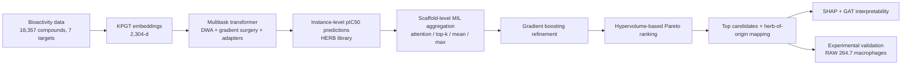

# KnowGraph-MTD

**Knowledge-Guided Graph Transformer and Hierarchical Multiple Instance Learning for Multi-Target Discovery of Natural Bioactive Compounds Against Autoimmune Disease-Associated Proteins**

This repository contains the code and data supporting the study **"Knowledge-Guided Graph Transformer and Hierarchical Multiple Instance Learning for Multi-Target Discovery of Natural Bioactive Compounds Against Autoimmune Disease-Associated Proteins"** (manuscript under review).

## Overview

Autoimmune diseases are driven by the simultaneous dysregulation of multiple immune-inflammatory signaling nodes, yet conventional therapies largely target single effectors. This study presents an integrated, interpretable deep learning pipeline for the systematic discovery of **multi-target natural products** against **seven autoimmune-relevant protein targets**:

| Target | Full name | Role |
|---|---|---|
| TNF | Tumor necrosis factor | Pro-inflammatory cytokine |
| STAT3 | Signal transducer and activator of transcription 3 | Cytokine signaling / immune regulation |
| TLR7 | Toll-like receptor 7 | Innate immune sensing |
| CSF1 | Colony-stimulating factor 1 | Macrophage regulation |
| PDCD1 | Programmed cell death protein 1 | Adaptive immune checkpoint |
| SRC | Proto-oncogene tyrosine-protein kinase Src | Immune cell signaling |
| ATRIP | ATR-interacting protein | DNA-damage / immune signaling |

The pipeline integrates:

1. **Curated multi-target bioactivity data** — 18,357 unique compounds with experimentally measured IC50 values (converted to pIC50) for the seven targets, curated from ChEMBL, PubChem, ChemSpider, ZINC, BindingDB, PDBbind, and STITCH.
2. **KPGT molecular embeddings** — 2,304-dimensional knowledge-guided graph transformer (KPGT) representations of molecular structures.
3. **Multitask transformer bioactivity model** — shared transformer encoder with task-specific adapter layers and output heads, trained with **dynamic weight averaging (DWA)** and **gradient surgery (GS)** to mitigate negative transfer. Under scaffold-based splitting, the full model achieved **Pearson r = 0.923, RMSE = 0.462, R² = 0.817**, outperforming single-task and ensemble baselines.
4. **Hierarchical multiple instance learning (MIL) screening** — 44,528 natural products from the HERB database were grouped into 2,695 Bemis–Murcko scaffold bags; instance-level predictions were aggregated by attention-based MIL, top-k, mean, and max pooling into consensus scores, refined by gradient boosting, and ranked by **hypervolume-based Pareto frontier analysis**.
5. **Mechanistic interpretability** — SHAP attribution on KPGT embedding dimensions and graph attention network (GAT) atom-level scoring identified structural complexity, aromatic-ring enrichment, and hydrogen-bonding capacity as primary drivers of multi-target bioactivity.
6. **Experimental validation** — hot-water extracts of the three top-prioritized botanicals — *Camptotheca acuminata* Decne, *Catharanthus roseus*, and *Uncaria gambir* — significantly suppressed TNF-α, IL-1β, TLR7, and CSF-1, restored IL-4, and reduced lipid peroxidation in LPS-stimulated RAW 264.7 macrophages.

## Key results

| Metric | Value |
|---|---|
| Multitask model (scaffold split) | Pearson r = 0.923 · RMSE = 0.462 · R² = 0.817 |
| Best binary classification (TLR7) | ROC-AUC = 0.951 · PR-AUC = 0.989 |
| HERB library screened | 44,528 natural products → 2,695 scaffold bags |
| Advanced scaffold bags (Pareto-ranked) | 135 |
| Non-dominated scaffold families | 5 (camptothecin class, vinca alkaloids, and others) |
| Consensus ranking stability | Kendall's τ = 0.72 (IQR 0.65–0.79) |
| Validated botanicals | *Camptotheca acuminata*, *Catharanthus roseus*, *Uncaria gambir* |

## Pipeline



## Repository structure

```
KnowGraph-MTD/
├── README.md                     # This file
├── .gitignore
├── data/
│   ├── README.md                 # Data description and availability
│   ├── bioactivity/              # Curated pIC50 training data for the 7 targets (*.tsv)
│   ├── targets/                  # Target protein structures and sequences (PDB/FASTA)
│   ├── libraries/                # Natural product libraries (HERB, CMAUP, TCMNCs, NCs sample)
│   └── representations/
│       └── TCMNCs/               # Complete small example of precomputed KPGT features
└── kpgt/                         # KPGT code used in this study
    ├── src/                      # LiGhT graph transformer (model, data, trainers)
    ├── scripts/                  # Pretraining, finetuning, feature extraction,
    │   │                         # MIL screening, IC50-aware scoring
    │   └── mil_results/          # External-validation screening results
    ├── environment.yml / env.yml / env.yaml
    ├── README.md / README_CPU.md / Representation.md
    └── LICENSE                   # Apache License 2.0 (upstream KPGT)
```

## Data

Detailed descriptions, schemas, and row counts are provided in [`data/README.md`](data/README.md).

- `data/bioactivity/` — complete curated bioactivity datasets for the seven targets (SMILES, target name, IC50 in nM, curation source, and target PDB IDs).
- `data/targets/` — PDB structures and FASTA sequences of the seven target proteins.
- `data/libraries/` — the HERB natural product library used for screening, plus external validation libraries (CMAUP, TCMNCs) and a toy sample of the NCs library.
- `data/representations/TCMNCs/` — a complete, small-scale example of the precomputed features consumed by the screening scripts (KPGT embeddings, RDKit molecular descriptors, and RDKit fingerprints).

**Toy-data policy.** This repository intentionally ships only a light-weight subset of the precomputed resources (see `data/README.md`). Large processed files — full-scale KPGT feature matrices (`*.npz`), memmap files (`*.dat`), pickled processed datasets (`*.pkl`), and pretrained/fine-tuned model checkpoints (`*.pth`) — are excluded because of their size (up to several GB). These can be requested from the corresponding author.

## Requirements

- Python 3.12
- PyTorch 2.7
- scikit-learn 1.7.0
- RDKit 2025.03.4
- SHAP 0.47.2
- umap-learn 0.5.7

For the KPGT environment, create a conda environment from `kpgt/environment.yml` as described in [`kpgt/README.md`](kpgt/README.md):

```bash
cd kpgt
conda env create -f environment.yml
conda activate KPGT
```

## Usage

### 1. Generate KPGT molecular embeddings

Use the pretrained KPGT model (download instructions in `kpgt/README.md`) to embed SMILES:

```bash
cd kpgt/scripts
python extract_features.py --config base --model_path <pretrained_model_path> \
    --data_path <smiles_csv_dir> --device auto
```

### 2. Train and evaluate the bioactivity model

Fine-tuning and evaluation scripts for the KPGT/LiGhT backbone:

```bash
python finetune.py --config base --model_path <pretrained_model_path> --data_path <dataset_dir>
python evaluation.py --config base --model_path <checkpoint> --data_path <dataset_dir>
```

> **Note:** the multitask transformer module (DWA + gradient surgery + task adapters) used to generate the reported multi-target predictions is not included in this release; please contact the authors for access.

### 3. Scaffold-level MIL screening

`ProjectionHead_MIL.py` implements the two-phase hierarchical MIL screening (scaffold bag construction, multi-pooling consensus scoring, and gradient boosting refinement) over precomputed KPGT features:

```bash
python ProjectionHead_MIL.py --help
```

### 4. IC50-aware external validation scoring

`IC50_aware_MIL_scoring.py` performs IC50-aware contrastive scoring of external natural product libraries (NCs, CMAUP, TCMNCs) against the seven-target panel:

```bash
python IC50_aware_MIL_scoring.py --help
```

Precomputed Top results are available in `kpgt/scripts/mil_results/`.

## Reproducibility

- Random seeds: `{22, 42, 62, 82, 102}` (the full pipeline was repeated five times; all coefficients of variation remained below the predefined stability threshold).
- Data partitioning: random split (80/10/10) and Bemis–Murcko scaffold-based split (primary evaluation).
- Ranking stability: 1,000 Dirichlet-sampled weight perturbations (Kendall's τ = 0.72, IQR 0.65–0.79).

## License and data availability

- The KPGT code under `kpgt/` is licensed under the **Apache License 2.0** (see `kpgt/LICENSE`).
- The curated bioactivity data, natural product libraries, and screening results in `data/` are released for research use with this study; please contact the authors for full-scale data and any reuse beyond research purposes.

## Citation

Citation will be added upon publication.

## Contact

For questions about the code, data, or the study, please open an issue in this repository or contact the corresponding author.
